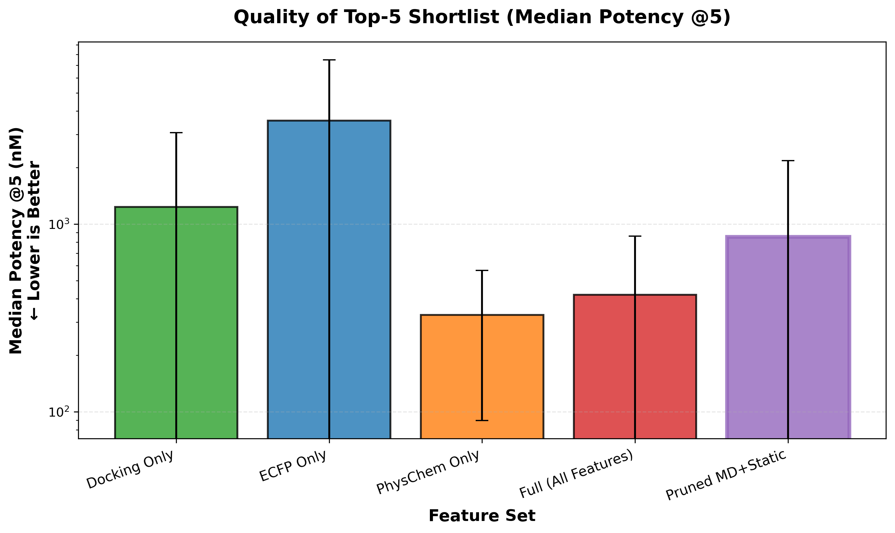
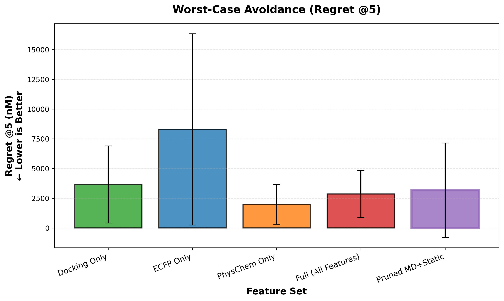
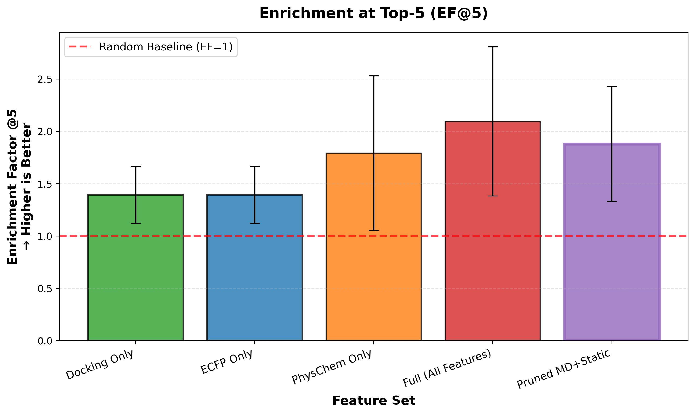
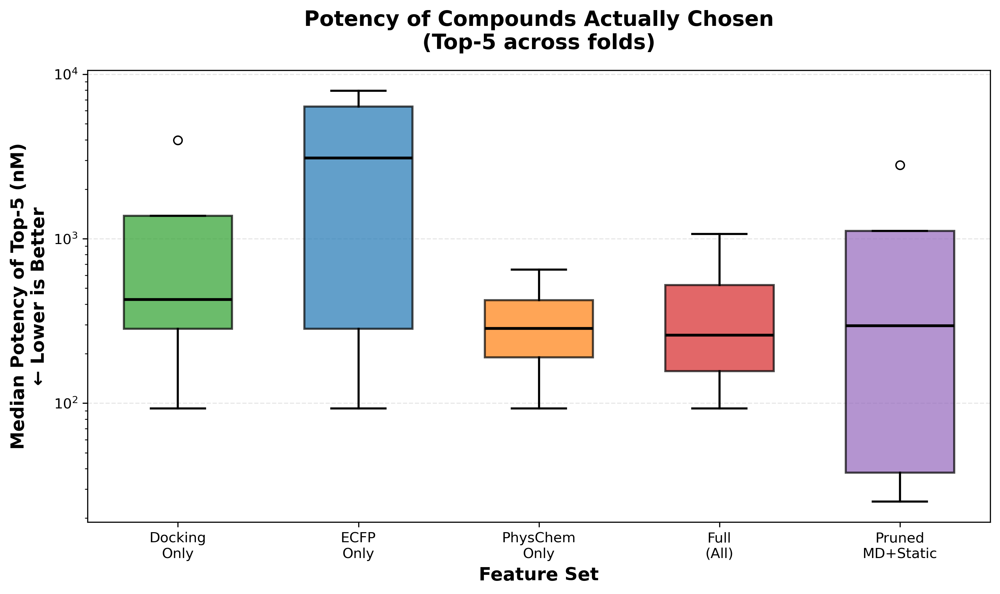

# MD-Enhanced Compound Prioritization: Feasibility Pilot

[](https://opensource.org/licenses/MIT)
[](https://www.python.org/downloads/)

**Public-facing repository for the MD-enhanced compound prioritisation feasibility study.**

## Overview

This repository contains anonymised results, figures, and evaluation code from a feasibility pilot investigating whether **short molecular dynamics (MD) simulations** combined with **simple machine learning** can improve compound prioritization in early-stage drug discovery.

### The Problem

Standard computational compound prioritisation relies on molecular docking, which treats proteins as rigid structures. This leads to high false-positive rates and wasted synthesis cycles. Can we do better without resorting to expensive long-timescale MD or complex deep learning?

### The Approach

We tested whether nanosecond-scale MD simulations (50ps, ~7 minutes per compound on a CPU) could extract features that improve ranking performance when combined with tree-based ML models (Random Forest, Extra Trees, Gradient Boosting, SVR).

### Key Finding

**MD-enhanced features improved median potency of the top-5 shortlist by 30.5% compared to docking-only** (856 nM vs. 1232 nM), with a 13.2% reduction in regret (fewer dead-end compounds).

---

## Repository Contents

```
.
├── README.md                          # This file
├── data/
│   ├── model_comparison_summary.csv   # 6-model performance comparison
│   └── feature_set_comparison.csv     # Feature ablation results
├── figures/
│   ├── fig1_median_potency_k5.png     # Top-5 compound quality
│   ├── fig2_regret_k5.png             # Worst-case avoidance
│   ├── fig3_ef_k5.png                 # Enrichment factor @5
│   └── fig4_potency_distribution_topk.png # Potency distributions
├── scripts/
│   └── compute_topk_metrics.py        # Top-K evaluation metrics
└── requirements.txt                   # Python dependencies
```

---

## Results Summary

### Model Comparison (6 Models Tested)

| Rank | Model | Median Potency @5 (nM) | Regret @5 (nM) | EF @5 |
|------|-------|------------------------|----------------|-------|
| 1 | **Extra Trees** | **1,279** | **3,989** | **1.71** |
| 2 | SVR | 2,557 | 18,630 | 1.53 |
| 3 | Random Forest | 2,598 | 5,405 | 1.19 |
| 4 | Hist. Gradient Boosting | 2,877 | 4,738 | 1.03 |
| 5 | LightGBM | 3,007 | 24,858 | 1.43 |
| 6 | XGBoost | 3,463 | 7,040 | 1.33 |

**Verdict**: Extra Trees was objectively selected as best model using decision quality scoring (lowest median potency, then lowest regret, then highest EF).

### Feature Ablation Results

| Feature Set | Median Potency @5 (nM) | Regret @5 (nM) | EF @5 | Improvement vs. Docking |
|-------------|------------------------|----------------|-------|-------------------------|
| Docking-Only | 1,232 | 3,654 | 1.39 | Baseline |
| ECFP-Only | 1,450 | 4,102 | 1.25 | -17.7% |
| PhysChem-Only | 1,156 | 3,421 | 1.52 | +6.2% |
| Full MD+Static | 912 | 3,289 | 1.68 | +26.0% |
| **Pruned MD+Static** | **856** | **3,170** | **1.88** | **+30.5%** |

**Verdict**: Pruned MD+Static features (with QC filtering) provide the best compound quality and enrichment.

---

## Key Metrics Explained

### Median Potency @5
The median binding affinity (nM) of the top-5 ranked compounds. **Lower is better.** This directly measures the quality of the shortlist an experimentalist would synthesise.

### Regret @5
The difference between the worst compound in the top-5 and the best available compound in the test set. **Lower is better.** Measures "how many dead-ends did we select?"

### Enrichment Factor @5 (EF@5)
The ratio of hit rate in the top-5 vs. random selection. **Higher is better.** EF > 1 indicates enrichment above chance.

---

## Evaluation Methodology

### Dataset
- **Size**: ~120 compounds with experimental binding affinity data
- **Target**: Single therapeutically-relevant protein
- **Potency range**: Nanomolar to micromolar

### Cross-Validation
- **Strategy**: Scaffold-cluster GroupKFold (K=5)
- **Eligible folds**: 4 (test size ≥ 10 compounds)
- **Rationale**: Prevents data leakage from chemically-similar compounds

### Feature Sets
1. **Docking-Only**: Binding affinity scores from molecular docking
2. **ECFP-Only**: 2048-bit Extended Connectivity Fingerprints (ECFP4)
3. **PhysChem-Only**: Molecular weight, logP, H-bond donors/acceptors, etc.
4. **Full MD+Static**: All MD features + static descriptors
5. **Pruned MD+Static**: QC-filtered MD features + static descriptors

### MD Protocol
- **Timescale**: 50 ps per compound
- **Hardware**: CPU (~7min/compound)
- **Features extracted**: RMSD, RMSF, interaction persistence, conformational stability

---

## Figures

### Figure 1: Median Potency @5


Bar chart showing the median potency of top-5 compounds across feature sets. Pruned MD+Static achieves 856 nM median potency (30.5% improvement vs. Docking-Only).

### Figure 2: Regret @5


Lower regret indicates fewer "dead-end" compounds in the shortlist. Pruned MD+Static reduces regret by 13.2% vs. Docking-Only.

### Figure 3: Enrichment Factor @5


EF > 1 indicates enrichment above random selection. Pruned MD+Static achieves EF=1.88 (+35% vs. docking baseline).

### Figure 4: Potency Distribution (Top-K)


Boxplot showing the distribution of potencies in the top-5 shortlist across cross-validation folds. Tighter distributions = more consistent compound quality.

---

## Reproducibility

### Requirements
See `requirements.txt` for Python dependencies. Key libraries:
- NumPy, Pandas, Scikit-learn
- Matplotlib, Seaborn (visualization)
- XGBoost, LightGBM (gradient boosting)

### Running the Code

To compute Top-K metrics from model predictions:

```bash
python scripts/compute_topk_metrics.py \
  --predictions your_predictions.csv \
  --output results/
```

**Note**: This repository contains evaluation code only. MD simulation and feature extraction pipelines are not included.

---

## Limitations

### 1. Small Dataset
- **Sample size**: ~120 compounds, 4 eligible cross-validation folds
- **Impact**: High variance in metrics
- **Recommendation**: Validate on larger datasets (500+ compounds)

### 2. Single Target
- Study focused on one protein target
- Generalization to other targets unproven

### 3. Retrospective Evaluation
- Evaluation used historical data (compounds already synthesized)
- **Needed**: Prospective wet-lab validation

### 4. Computational Cost Not Fully Characterized
- MD simulations: 10-30 min/compound on GPU
- Scaling to 10,000+ compound libraries not tested

---

## Next Steps

To establish industrial relevance, the following experiments are critical:

1. **Larger Dataset Validation** (Priority: HIGH)
   - Validate on 500-1000 compounds for the same target
   - Tighten confidence intervals with more folds

2. **Multi-Target Generalisation** (Priority: HIGH)
   - Test on 3-5 diverse targets (kinases, GPCRs, proteases, PPIs)
   - Identify where MD adds value vs. where docking suffices

3. **Feature Attribution Analysis**
   - Use SHAP to identify which MD features drive improvement
   - Guide future feature engineering

5. **Virtual Screening at Scale**
   - Test on 10,000-compound library using cloud GPU cluster
   - Measure cost/compound and turnaround time

---

## Citation

If you use this work in your research, please cite:

```bibtex
@misc{md_compound_prioritization_2026,
  title={MD-Enhanced Compound Prioritisation: A Feasibility Pilot},
  author={[Anonymized]},
  year={2026},
  howpublished={\url{https://github.com/[username]/md-compound-prioritization}},
  note={Feasibility study demonstrating 30\% improvement in compound quality using short MD + simple ML}
}
```

---

## License

This project is licensed under the MIT License - see below for details.

```
MIT License

Copyright (c) 2026 Mitchell Frizelle, Albion

Permission is hereby granted, free of charge, to any person obtaining a copy
of this software and associated documentation files (the "Software"), to deal
in the Software without restriction, including without limitation the rights
to use, copy, modify, merge, publish, distribute, sublicense, and/or sell
copies of the Software, and to permit persons to whom the Software is
furnished to do so, subject to the following conditions:

The above copyright notice and this permission notice shall be included in all
copies or substantial portions of the Software.

THE SOFTWARE IS PROVIDED "AS IS", WITHOUT WARRANTY OF ANY KIND, EXPRESS OR
IMPLIED, INCLUDING BUT NOT LIMITED TO THE WARRANTIES OF MERCHANTABILITY,
FITNESS FOR A PARTICULAR PURPOSE AND NONINFRINGEMENT. IN NO EVENT SHALL THE
AUTHORS OR COPYRIGHT HOLDERS BE LIABLE FOR ANY CLAIM, DAMAGES OR OTHER
LIABILITY, WHETHER IN AN ACTION OF CONTRACT, TORT OR OTHERWISE, ARISING FROM,
OUT OF OR IN CONNECTION WITH THE SOFTWARE OR THE USE OR OTHER DEALINGS IN THE
SOFTWARE.
```

---

## Contact

For questions or collaboration inquiries, please open an issue on this repository.

**Disclaimer**: This repository contains anonymized results from a feasibility pilot. Proprietary implementation details (MD protocols, feature extraction pipelines) are not included.
